# chemunited-sim Examples

## `full_platform.py` — Gas-Liquid Pressurised Reactor

A self-contained simulation that exercises every component type, both fluid
phases, chemical reactions, a back-pressure regulator, a mid-run valve switch,
and SQLite recording — all in one script you can read top to bottom.

---

### What the platform does

A nitrogen gas stream (3 bar) and a liquid reagent stream (3 mL/min) merge at
a T-junction and flow through a short plug-flow tube into a 10 mL pressurised
vessel reactor.  Inside the reactor, `reagent_a` undergoes first-order liquid-
phase decay to `product_b` (k = 0.05 s⁻¹).  Gas continuously exits through a
back-pressure regulator (BPR, setpoint 2 bar) that holds the reactor above
operating pressure.  Downstream of the BPR a two-position rotary valve directs
flow to either a collection sink or a waste sink; it switches at t = 20 s.



---

### Components used (all 7 types)

| Type | Instances | Role |
|---|---|---|
| `PressureControlData` | `gassupply`, `productsink`, `wastesink` | Dirichlet pressure boundary conditions |
| `FlowSourceData` | `liquidpump` | Neumann flow boundary condition (3 mL/min) |
| `PlugFlowComponentData` | `gastube`, `liquidtube`, `reactortube`, `outlettube`, `collecttube`, `wastetube` | Transport edges with Hagen-Poiseuille resistance |
| `VesselComponentData` | `reactor` | Inventory node — accumulates liquid & gas, site of reactions |
| `BackPressureRegulatorData` | `bpr` | Opens when upstream pressure ≥ setpoint |
| `JunctionData` | `tmixer` | Lossless T-junction; merges gas and liquid streams |
| `ValveComponentData` | `divertvalve` | Two-position rotary selector; switched at t = 20 s |

---

### BPR physics — why the parameters are chosen this way

For the BPR to open stably, the reactor pressure must exceed the setpoint.
The reactor pressure is set by the balance between upstream and downstream
hydraulic resistance:

```
P_reactor ≈ P_sink + R_downstream × Q
```

With the outlet lines narrowed to D = 1.5 mm the downstream resistance is
roughly **3× larger** than the upstream resistance (short 5 cm reactortube,
D = 2 mm).  This pushes the reactor pressure to ≈ 2.45 bar, comfortably above
the 2 bar setpoint, so the BPR opens and stays open from the first step.

If you reverse this ratio (long upstream tube, wide outlet) the reactor settles
near sink pressure and the BPR never opens.

---

### Valve transport routing — the hub patch

The transport engine routes exiting pockets through JUNCTION edges until they
reach either an **inventory node** or a **hub node** (`is_hub=True`).  The
standard compiler does not mark the valve centre port (port 0) as a hub, so
pockets arriving there would be silently discarded.

The script patches this immediately after `compile_graph`:

```python
_old = graph.nodes["divertvalve.0"]
graph.nodes["divertvalve.0"] = HydraulicNode(
    node_id=_old.node_id, boundary=_old.boundary,
    is_hub=True, component=_old.component,
)
```

This activates the hub-merge routine (`_process_hub`), which distributes
merged pockets proportionally to the displaced volumes of outgoing transport
edges — the open channel gets all the flow, the closed channel gets nothing.

---

### Simulation timeline

| Time | Event |
|---|---|
| t = 0 s | Simulation starts; valve in **COLLECT** position (port 0 ↔ port 1) |
| t = 20 s | `rotate_rotor` called; valve switches to **WASTE** position (port 0 ↔ port 2) |
| t = 60 s | Loop ends; recorder closed; results printed |

---

### Running the example

```bash
# from the repo root
python examples/full_platform.py
```

The script prints progress every 10 s of simulation time, a summary of reactor
state, key node pressures, transport queue lengths, flow rates, and a
text-mode bar chart of `reagent_a` decay read back from the SQLite database.

A timestamped `.db` file is written to `examples/simulation/` and can be
opened with any SQLite viewer.

---

### Output tables in the SQLite database

| Table | Content |
|---|---|
| `meta` | Run parameters (dt, record_interval, platform_name, timestamp) |
| `edge_cells` | Cell geometry for every transport edge |
| `node_pressure` | Nodal pressures (Pa) at each recorded time-point |
| `edge_flow` | Signed volumetric flow rates (m³/s) for every edge |
| `inventory_state` | Vessel pressure (Pa) and temperature (K) over time |
| `inventory_content` | Species moles and phase volumes per vessel per time-point |
| `cell_state` | Phase fraction and temperature per cell per edge |
| `cell_content` | Species moles per cell per edge |

---

### Expected results (approximate)

- Reactor pressure stable at **≈ 2.45 bar** throughout
- Liquid volume constant at **3.0 mL** (batch liquid, continuous gas)
- `reagent_a` conversion reaches **≈ 95 %** by t = 60 s
- Flow routes through `collecttube` for 0–20 s, then through `wastetube`
